# Bikesharing

## Overview of Project
The purpose of this project is to analyze data from the Citibike program in New York City over 2019 to see if it would be possible to replicate the program in Des Moines, Iowa. There is also a potential investor for the project. By analyzing the New York City data, you can gain an understanding of how the business works and what some of the possibilities and hindrances might be to adapt this program in Des Moines.

## Tools

- Tableau Desktop and Public versions
- Python
- Pandas library
- Jupyter Notebook

## Results

### Part 1

This portion of the project involved using Jupyter Notebook, Python and the Pandas library to read in a .csv file, then to transform the datatype of one of the columns and export the results to a .csv file.

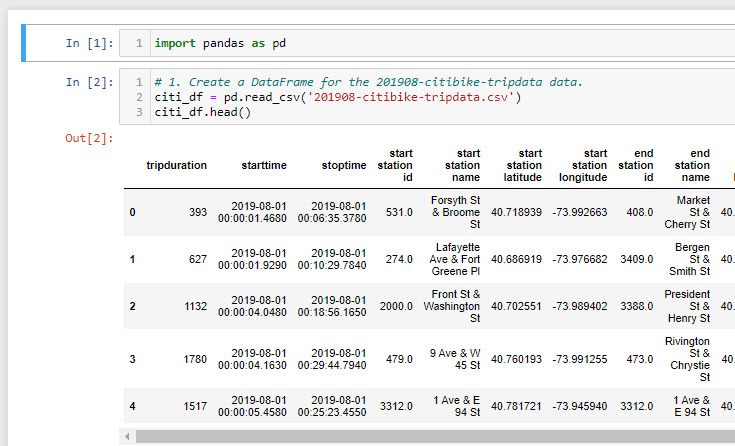

The first step was to read in the original .csv file and convert it to a dataframe using Python and Jupyter Notebook.

***

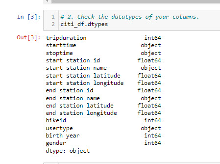

The second step was to check the data types of the .csv file.

***

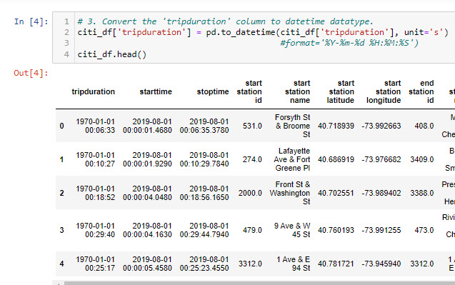

Step three involved converting the tripduration column from an integer to a datetime format using Python and Pandas.

***

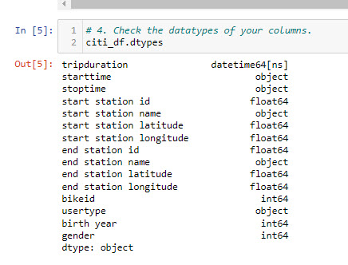

Step four was to recheck the datatypes.

***

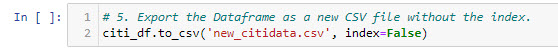

In step five the dataFrame was exported as a .csv file.

### Part 2

For this section, visualizations were created to show the following:

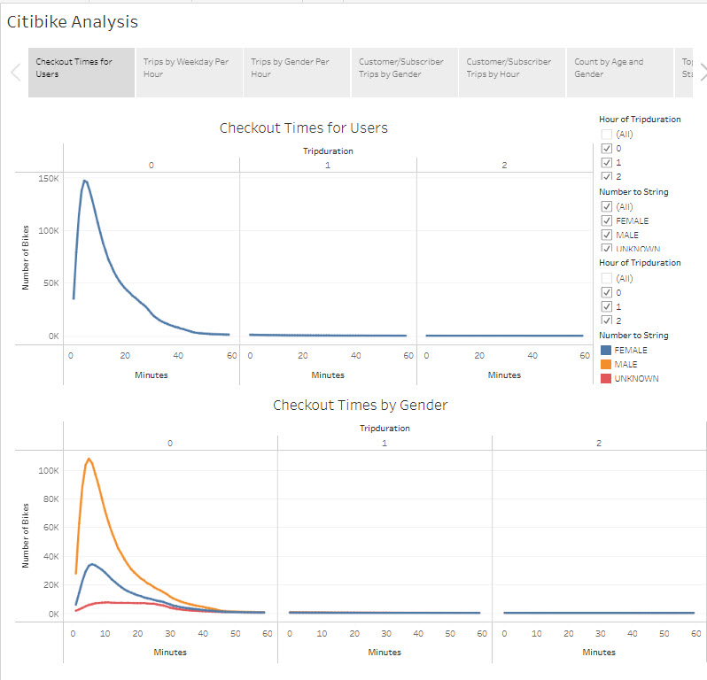

These two visualizations show the length of time bikes are checked out for: 1) all riders and 2) length of rides separated by gender.

***

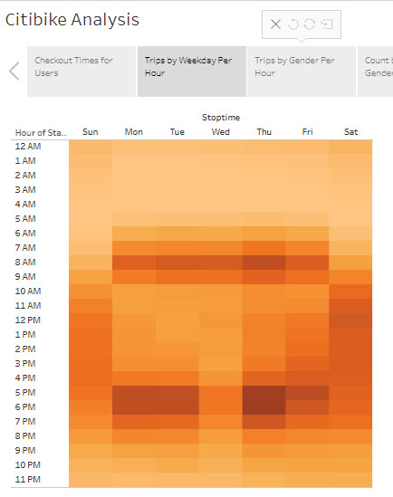

The heatmap above shows the number of trips by hour for each day of the week for all riders.

***

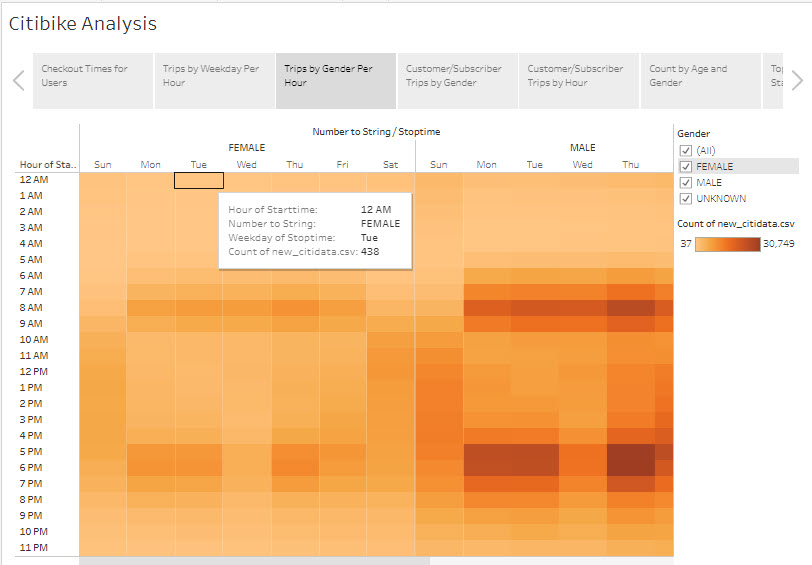

The heatmap above shows the number of trips by hour for each day of the week broken down by gender.

***

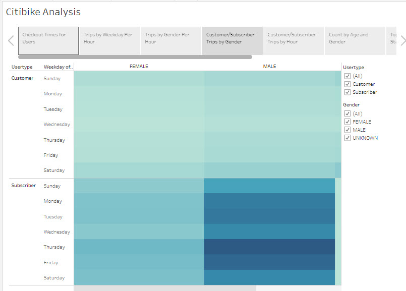

This visualization uses a heatmap to show the breakdown of what days of the week a user might be more likely to check out a bike by type of user (customer or subscriber) and gender.

### Part 3

Additional visualizations were created to showthe following:

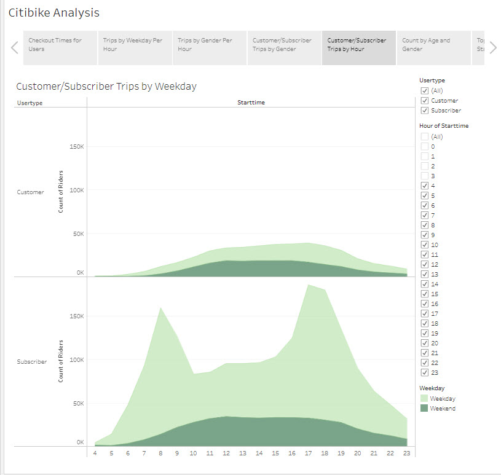

This visualization shows the number of trips taken by customers vs. subscriber broken down by weekday and weekend trips.

***

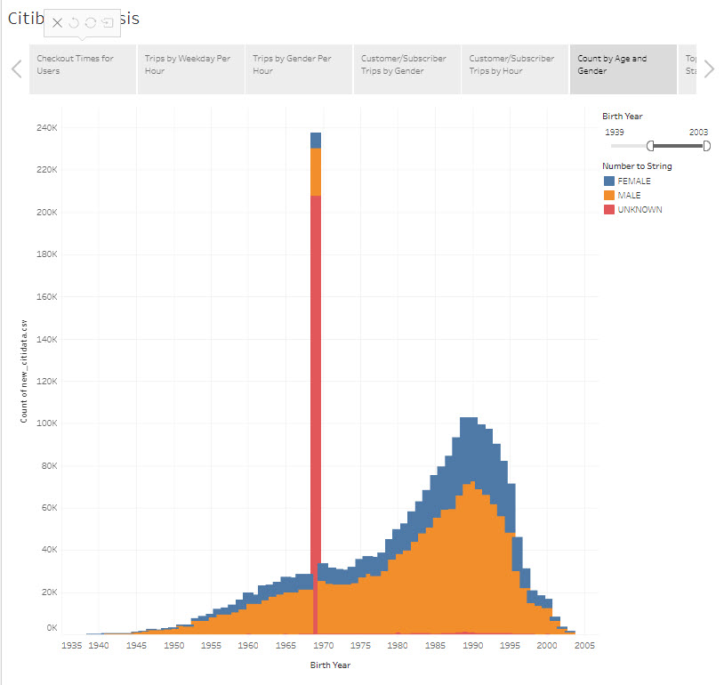

This visualization shows a detailed number of trips taken by age and gender. 

***

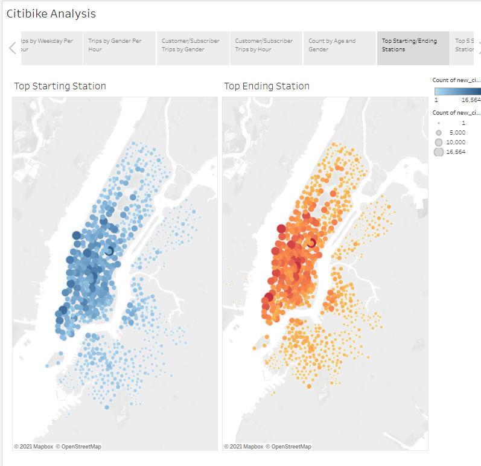

These bubble maps show the top starting and ending stations.

***

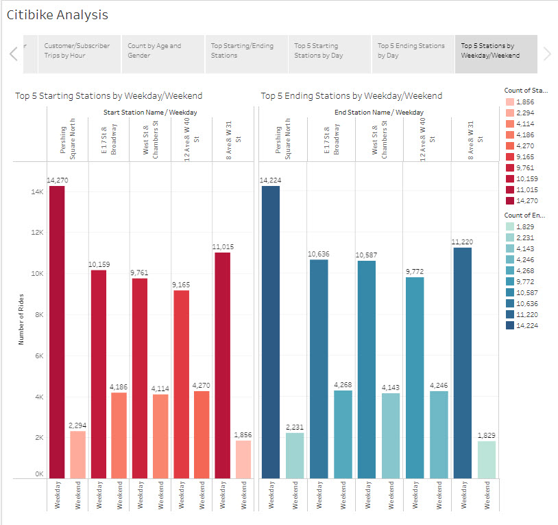

This bar graph provides more detail into the 5 top starting and ending stations separated by weekdays and weekend days.

## Summary

Looking at the data showing the length of time of the trips, it seems like the gender-specific data follows the data for all riders closely. One revealing point about the data is that most rides are very short. Most users are not traveling over long distances or the length of the rides would be longer. Many users may be commuting a short distance to work after leaving a subway station. Those who are using the bikes to sightsee may only take a short trip from one attraction to another.

The heatmaps show the greatest number of rides broken down by hour. There is little difference in the greatest number of rides by hour between males, females and unknown riders; however, the highest number of rides are taken by males. It is apparent that there are two peak time periods during the weekdays when users are starting work and getting off from work. Over the weekends the number of riders is more evenly spread out. 

Customer and subscriber trips by gender show that there are far fewer trips taken by customers than subscribers. The highest number of trips fall on weekdays and males comprise the greatest number of riders when compared to females and unkown. Overall the greatest number of rides for both customers and subscribers take place on weekdays.

When looking at the number of rides by hour broken down by customers and subscribers, it is apparent that far more subscribers ride the bicycles during the weekday compared to customers than on the weekend. Customers purchase tickets only for a short time, while subscribers use the service regularly. Since riders who commute are more likely to subscribe to the service than short-term customers, this is an expected outcome. The peak hours are also readily apprent during the weekday commute. On the weekend, it seems that both tourists (most likely customers) and subscribers (possibly residents) use the service, with subscriber numbers at almost twice that of customers. Whether they are enjoying the sights or running errands, there is still a Citibike presence on weekends.

The graph that shows the count by age and gender shows one anomaly. The birth year 1969 shows an unusually high number of trips. One theory is that this could be caused by someone filling out incorrect data, perhaps because they did not want to reveal personal information. The year might also have been filled in by station workers, possibly when a user did not fill in a birth year. 

In looking at the bubble maps showing the top starting and ending stations it is evident that there is a high number of riders in a very tight, concentrated area. The further out from the center of Manhattan, the fewer the number of riders there are. Manhattan hosts some great tourist spots and is also a hub for national and international business. In locations where there is neither concentrated businesses nor tourist spots, the number of riders decreases.

The final bar chart shows the top 5 starting and ending stations broken down by weekday and weekend. Looking at Pershing station and 8 Ave. & W 31 St stations, it appears that both stations have a high number of working commuters and fewer tourists. Their numbers are very high during the weekday but drop dramatically on the weekends. The other three stations have a high number of commuters, but it seems that they may also have some attractions for riders on the weekends as the weekend numbers are still fairly high.

The task of opening a Citibike project in Des Moines, Iowa may prove to be a difficult task. Since the number of users by far is comprised of subscribers, there would need to be a large number of people who use the bicycles to commute to work. Cities in the Midwest have a completely different demographic than Manhattan. Business places are not necessarily concentrated in the downdown area, and even for those businesses that operate downtown, the majority of the workers live in the suburbs and commute in to work. By looking at the average duration of rides for Manhattan, it is apparent that most commuters in Des Moines would have to travel far more than 20 minutes from the suburbs to downtown.

Manhattan is also a hub for tourists. There are a multitude of attractions for people visiting from out of town. Des Moines has few tourist attractions compared to Manhattan. In addition, many New Yorkers do not own a car, so going from place to place even on the weekend is frequently done by bicycle, walking, taxi rides or subway. In other parts of the country, an automobile is a necessity. Having space for housing in the suburbs offers people room to own a house, spread out and raise a family, but this also means that they may not live close to their workplace and a bicycle may not be useful.

The weather in Des Moines may also play a factor in opening a Citibike program. The summers are hot and humid and the humidity does not let up in the winter. Winters are bitter cold and icy. While the weather in Manhattan may share some similarities with Des Moines, if users are spending more than 20 minutes commuting the weather could make the ride unbearable. 

While the program in Des Moines would be a possibility for Des Moines, it would have to be on a very limited scale. Further analysis would need to be done to see if it could be profitable based on the limitations noted above.

#### Link to Tableau Public

https://public.tableau.com/authoring/CitibikeAnalysis_16404832808570/CitibikeAnalysis#1

